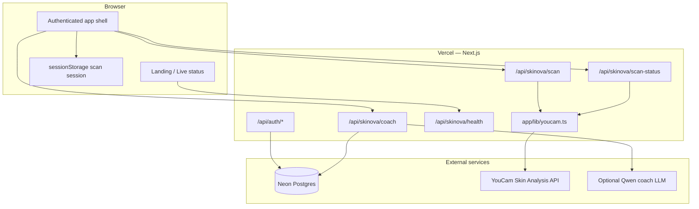

# Skinova architecture

Skinova is a Next.js 15 full-stack web app. The browser never calls YouCam directly; all Skin AI requests run through server-side API routes. User accounts persist in Neon Postgres; the latest scan session persists in the browser until the user clears it or runs a new scan.

## High-level diagram



## Repository layout

```text
app/
  page.tsx                 Public landing
  login/ signup/           Auth pages
  privacy/ terms/          Legal pages
  (app)/                   Authenticated routes (middleware-protected)
    dashboard/ scan/ results/ routine/ coach/ progress/ settings/
  api/
    auth/                  Signup, login, logout, session
    skinova/               Product API (scan, coach, health, reset)
    youcam/                Low-level YouCam proxy (internal / smoke)
  components/              UI experiences per page
  lib/
    youcam.ts              YouCam client, normalization, mock mode
    run-skin-scan.ts       Scan orchestration
    scan-session.ts        Browser session persistence
    coach-service.ts       RAG + LLM coach
    db.ts auth.ts          Neon + JWT sessions
public/
  samples/                 YouCam playground sample selfies
  screenshots/             Submission screenshots
  brand/                   Logos and favicons
docs/                      Project documentation (this folder)
scripts/                   Setup, smoke tests, DB init, knowledge ingest
```

## Authentication

- **Sign up / log in** → bcrypt password hash stored in Neon `users` table.
- **Session** → HTTP-only cookie signed with `AUTH_SECRET` (JWT via `jose`).
- **Middleware** (`middleware.ts`) redirects unauthenticated users away from `/dashboard`, `/scan`, `/results`, `/routine`, `/coach`, `/progress`, `/settings`.

## Skin scan flow (live mode)

1. User uploads a selfie or selects a bundled sample (`public/samples/`).
2. `POST /api/skinova/scan` validates the image (≥480px short side, JPG/PNG, ≤10MB).
3. `runSkinScan()` calls YouCam:
   - `POST /s2s/v2.0/file/skin-analysis` → presigned upload URL + `file_id`
   - `PUT` image bytes to presigned URL
   - `POST /s2s/v2.0/task/skin-analysis` → `task_id`
4. Client polls `GET /api/skinova/scan-status/[taskId]` until analysis is ready.
5. `youcam.ts` maps YouCam `ui_score` output → `AnalysisResult` (scores, concerns, reading steps).
6. Result saved to `sessionStorage` via `saveScanSession()` and shown on Results, Routine, Coach, Progress.

**Demo mode** (`SKINOVA_DEMO_MODE=true` or missing `API_KEY`): mock task IDs and representative analysis data — no YouCam units consumed.

## Scan UX (client)

`scan-experience.tsx` implements the judge-visible flow:

1. Select or upload a photo
2. Start live scan
3. Six-step progress stepper (`scan-steps.ts` + `scan-stepper.tsx`)
4. Inline results with links to full Results and Routine pages

## Downstream features (post-scan)

| Page | Data source |
| --- | --- |
| Results | Latest `sessionStorage` analysis |
| Routine | Derived from analysis concerns |
| Coach | User message + optional scan context; Neon knowledge RAG + optional Qwen LLM |
| Progress | Trend cards projected from latest scan concerns |
| Settings | Clear scan session / coach history |

Scan history is **per browser session**, not per user in the database (documented limitation).

## YouCam API surface in production

| API | Status in Skinova |
| --- | --- |
| **AI Skin Analysis** | **Integrated** — primary user flow |
| AI Skin Simulation | Library support only; Progress uses score projection, not simulation images |
| Fitzpatrick / Skin Tone / Face Analyzer | Library stubs, not exposed in UI |

## Environment modes

| Mode | Condition | Scan behavior |
| --- | --- | --- |
| Live | `API_KEY` set, `SKINOVA_DEMO_MODE=false` | Real YouCam tasks |
| Demo | Missing key or `SKINOVA_DEMO_MODE=true` | Mock analysis |

Landing page **Live status** section calls `GET /api/skinova/health` to show online/demo/live state (replaces the former `/health` page).

## Security

- YouCam `API_KEY` and `SECRET_KEY` are server-only (never in client bundles).
- Smoke scripts print sanitized status only (no keys, file IDs, or presigned URLs).
- Coach and scan routes require authentication where applicable.
- Privacy and Terms pages describe data handling at https://skinova-ai.vercel.app.
